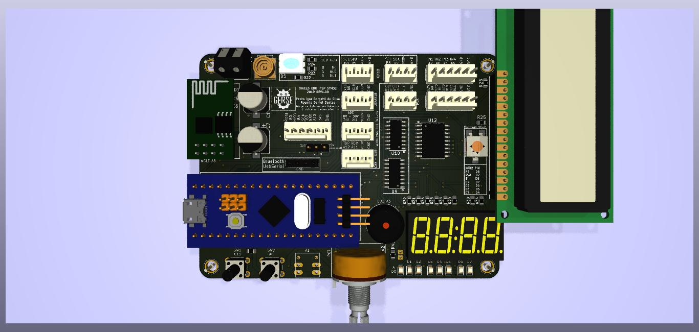
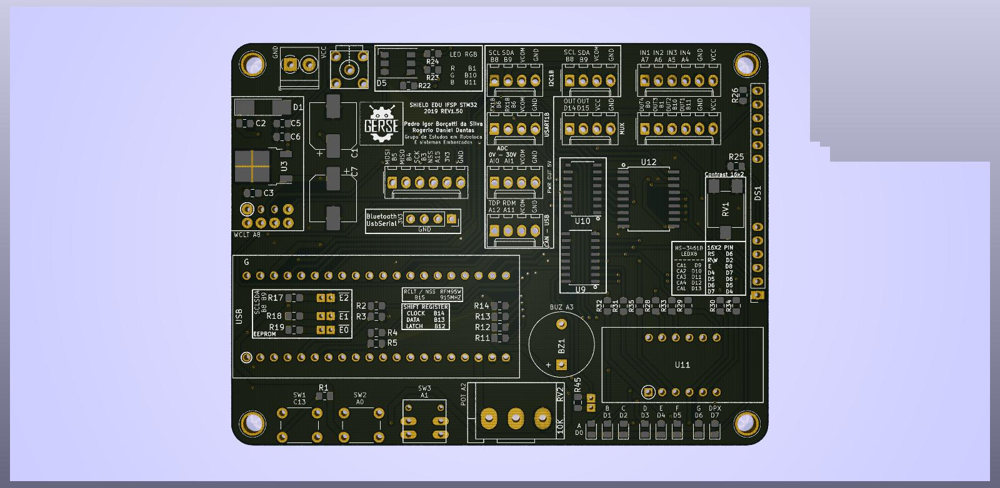

 
# ShieldEduIfspStm32

Licença: GNU GPL 2

Autores: [Pedro Igor Borçatti da Silva](https://github.com/pedro-ibs), Rogerio Daniel Dantas

This program is free software; you can redistribute it and/or
modify it under the terms of the GNU General Public License as
published by the Free Software Foundation; version 2 of the
License.

This program is distributed in the hope that it will be useful,
but WITHOUT ANY WARRANTY; without even the implied warranty of
MERCHANTABILITY or FITNESS FOR A PARTICULAR PURPOSE.  See the
GNU General Public License for more details.

---

O SHIELD EDU IFSP STM32 é uma placa didática criada para a [blue pill](https://wiki.stm32duino.com/index.php?title=Blue_Pill) de baixo custo, desenvolvida para o ensino de lógica de programação aplicada à robótica e Iot (internet das coisas), cujo principal objetivo é facilitar o ensino de lógica de programação. 

Neste Repositório se encontra todos os arquivos necessários para o **DESENVOLVIMENTO e DOCUMENTAÇÃO** para a **SHIELD EDU IFSP STM32**, esse projeto encontra se em desenvolvimento.

Na pasta [PCB](PCB/) estão os arquivos para fabricação da placa, tanto o [GERBER](PCB/) para fabricação manufaturada. Em [Documentação](Documentação/) temos os arquivos referente as informações e manuais do circuito criadas até o momento, como o  [esquema elétrico](Documentação/ShieldEduIfspStm32.pdf).  Em [circuitoKicad](circuitoKicad/) temos os arkivos edivaves do projeto  (desenvolvido no [kicad EDA 5.0.2](http://www.kicad.org/)) suas dependências (exceto os pacotes 3D da PCB).

# Notas de versão
 * REV160
   * Removido seletor VCOM das saidas modulares (agora apenas 5V exceto SPI).
   * Bluetooth ajustado na PCB (restava trombando com o blue pill).

# Visual aproximado do circuito:

